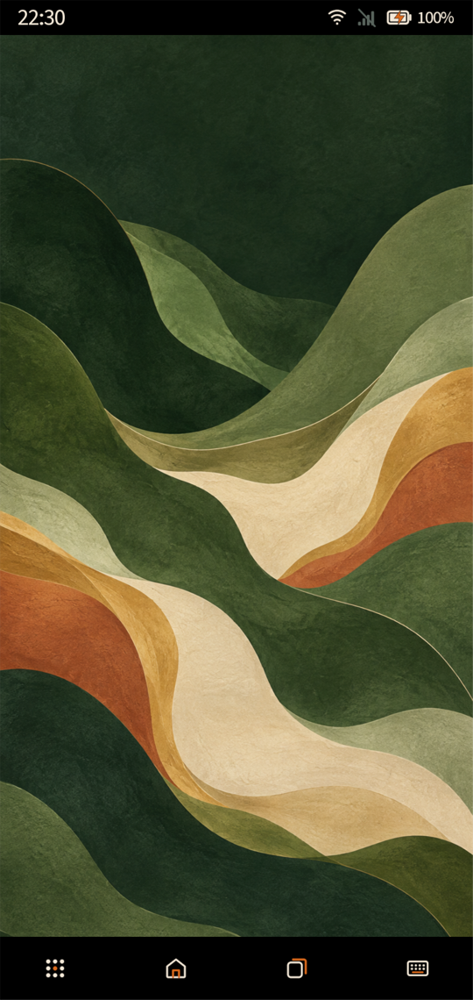
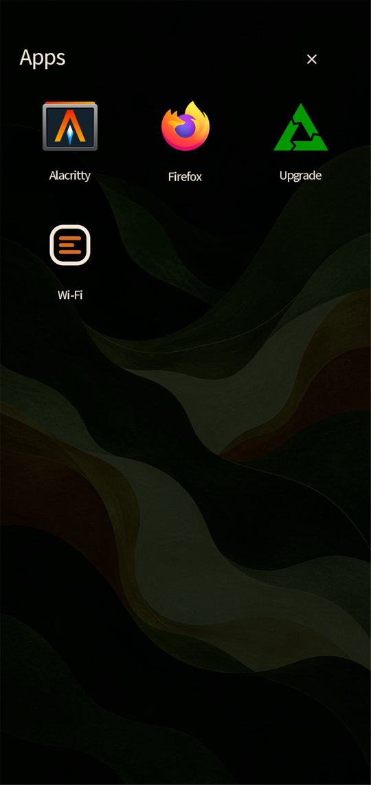
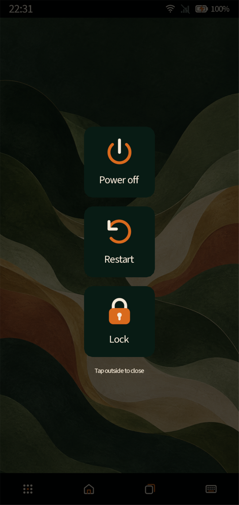
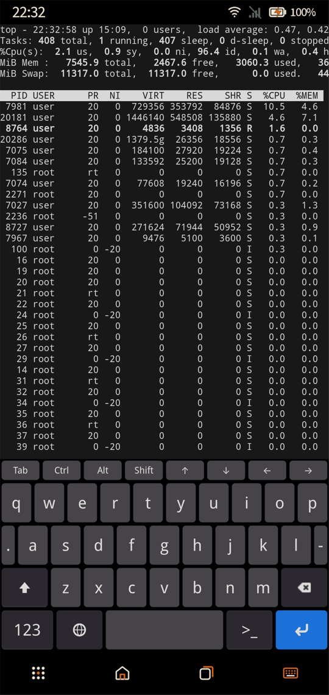

# Koya Phone

A touch interface for Linux phones, built with [Koya](https://www.koya-ui.com)
and [Hyprland](https://hypr.land) on [postmarketOS](https://postmarketos.org).

Koya draws the shell: the status bar, app launcher, desktop overview,
notifications, power menu and swipe lock screen. Hyprland manages applications
and their desktops. The interface uses large touch targets, native animations
and haptic feedback.

This is an experimental project, developed on the OnePlus 6.

## Screenshots

<p align="center">
  <a href="docs/screenshots/home.png"></a>
  <a href="docs/screenshots/apps.png"></a>
  <a href="docs/screenshots/power-menu.png"></a>
  <a href="docs/screenshots/terminal-keyboard.png"></a>
</p>

<p align="center">Home · App launcher · Power menu · Terminal and keyboard</p>

Captured from the running shell on a OnePlus 6 at 2× display scale. Click an
image to view it at full size.

## What it does

- **Apps and desktops:** discover installed `.desktop` files and their icons,
  launch each app on its own desktop, switch between open apps and close windows.
- **Status and notifications:** battery, charging, Wi-Fi and mobile network
  status, notification banners and a swipe-down notification panel.
- **Wi-Fi settings:** scan, join networks, reconnect using saved profiles,
  disconnect and forget networks.
- **Device controls:** hardware volume buttons, a volume indicator, brightness
  control and haptic feedback.
- **On-screen keyboard:** Squeekboard integration, automatic activation for
  editable fields and a manual toggle on the bottom bar.
- **Power and locking:** short power presses switch the display off/on; hold
  to open the power menu. Idle timeouts lock the UI and switch off the panel.

The swipe lock is currently a visual overlay. **It does not provide authentication
or compositor-enforced security.** Secure locking and PAM integration are planned.

## Install

Start with a working postmarketOS installation: device drivers, display, audio
and internet access must already be configured. Run as the intended graphical
user with `curl` and access to `sudo` or `doas`:

```sh
curl -fsSL https://raw.githubusercontent.com/Omnomios/koya-phone/main/install.sh | sh
```

The POSIX shell installer requests privileges when needed, downloads and verifies
matching Koya packages, builds the native components and configures tinydm to
start the Koya/Hyprland session. Installation changes the graphical session and
starts it when complete.

Current targets:

| Component | Requirement |
| --- | --- |
| Distribution | postmarketOS v25.12 / Alpine v3.23, with apk-tools 3 |
| Compositor | Hyprland 0.51.x |
| UI engine | Koya build 888 or newer, with matching D-Bus and process plugins |
| Reference device | OnePlus 6 (`enchilada`), using 2× display scale |

The installer is experimental and still needs validation on clean images.
Other devices need testing; the generic profile keeps their existing hardware
integration.

For version pins, forks, root-shell installation and `--no-start`, see the
[installation guide](docs/installation.md).

## Using the shell

| Action | Control |
| --- | --- |
| Open the app launcher | Apps button on the bottom bar |
| Return home | Home button on the bottom bar |
| Switch or close applications | Desktops button on the bottom bar |
| Show or hide the keyboard | Keyboard button on the bottom bar |
| Notifications, brightness and Wi-Fi settings | Swipe down from the top bar |
| Switch the display off/on | Short press of the power button |
| Power off, restart or lock | Hold the power button |
| Dismiss the visual lock screen | Swipe up |

Applications use desktops starting at 2. Desktop 1 is Home. Existing application
windows are focused when possible; secondary windows can share their app's desktop.

## Configuration

Edit `session.conf` in the deployed shell directory and restart the graphical
session to apply changes. The installer preserves existing settings on reruns.

| Setting | Default |
| --- | --- |
| Idle lock and display-off | 120 seconds |
| Display-off while on the lock screen | 30 seconds |
| Suspend after confirmed display-off | 180 seconds |
| Volume step | 5% |
| Volume indicator | Left side, visible for 1.8 seconds |
| Minimum brightness | 5% |
| Touch and volume haptics | Enabled |

Set an idle timeout to `0` to disable it. Automatic suspend requires authorization
from elogind and respects sleep inhibitors; device suspend/resume support still
needs hardware testing.

Hyprland settings live in `/etc/koya-shell/hyprland.conf`. The installer generates
them from [hyprland.conf.in](hyprland.conf.in) and preserves existing tuning.

## Development

The UI is JavaScript under [apps/](apps/), running directly in Koya. There is no
Node.js runtime or web frontend. Native C++ under [native/](native/) handles input,
session lifecycle and OS integration through D-Bus and Hyprland IPC. UI state and
interaction policy stay in Koya.

Build dependencies on Alpine:

```sh
apk add build-base meson ninja pkgconf glib-dev libevdev-dev eudev-dev
```

Build as your regular user:

```sh
meson setup build -Dintegration_tests=false
meson compile -C build
```

Install a local checkout with `sh ./install.sh --source-dir .`. Runtime packages
and device profiles are listed in [install/packages/](install/packages/).

- [Installation guide](docs/installation.md): packages, services and deployment.
- [Technical reference](docs/technical-reference.md): component lifecycle, D-Bus
  interfaces and implementation details.
- [D-Bus integration notes](docs/dbus-plugin-issues.md): earlier plugin issues and
  the build 888 integration.

Logs are written to `~/.local/state/koya-shell/`; compositor output is in
`~/.local/state/tinydm.log`.

## Current scope

This is a phone shell, not a complete mobile distribution. Secure locking,
telephony UI, hidden-network entry and enterprise Wi-Fi credential setup are
not implemented. Existing enterprise network profiles can be activated.

The shell is licensed under the [MIT license](COPYING). Koya and other dependencies
have their own licenses.
